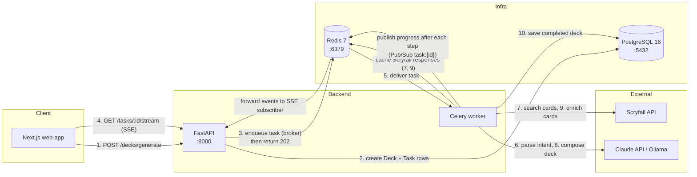
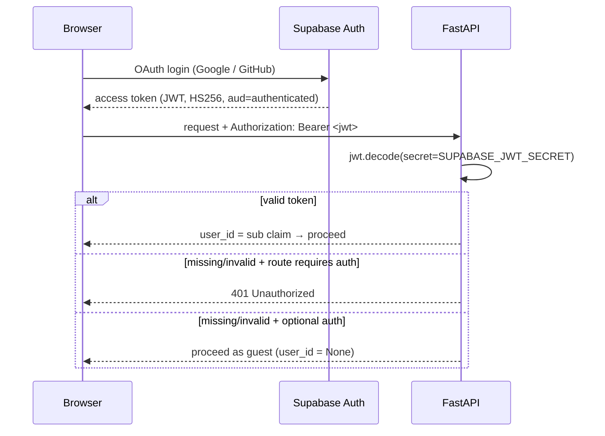
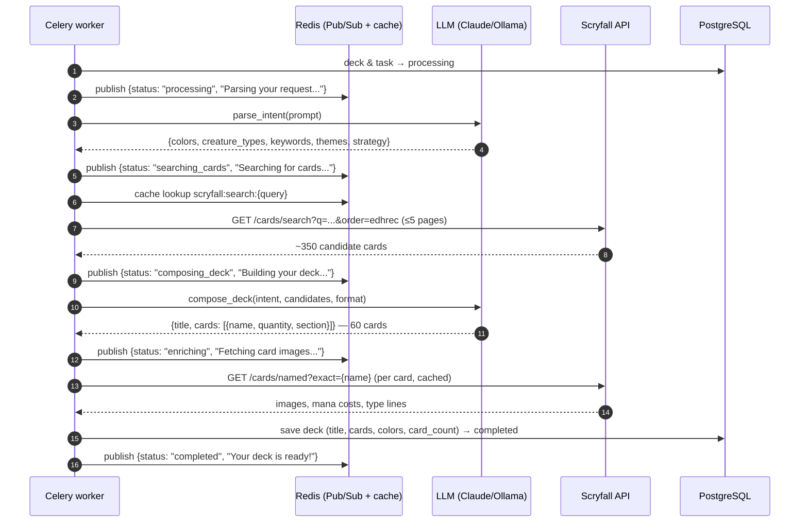
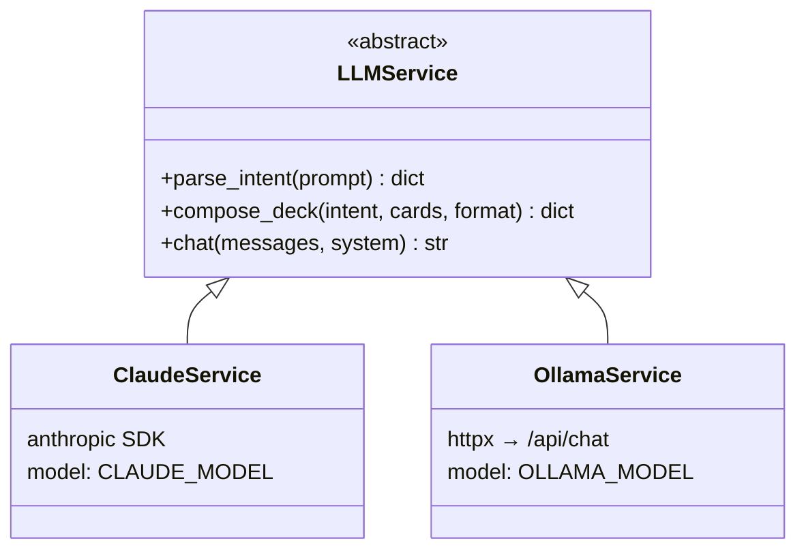
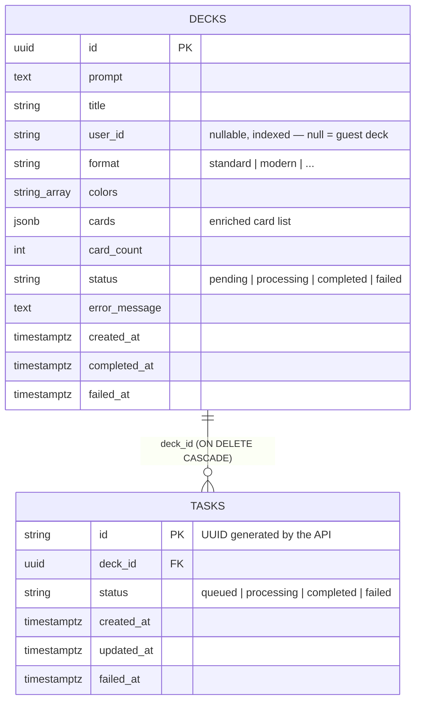

# Magic Grimoire — API Server

FastAPI backend for Magic Grimoire, an AI-powered Magic: The Gathering deck generator. Users describe a deck in natural language; the server orchestrates an LLM (Anthropic Claude or local Ollama) and the [Scryfall](https://scryfall.com/docs/api) card database to produce a balanced 60-card deck, streaming progress to the browser in real time.

- **Stack:** Python 3.13 · FastAPI · SQLAlchemy 2 (async, asyncpg) · Celery 5 · Redis 7 · PostgreSQL 16 · uv
- **All routes are mounted under `/api/v1`.** Interactive docs at `http://localhost:8000/docs`.

---

## Table of Contents

1. [High-Level Architecture](#high-level-architecture)
2. [Project Layout](#project-layout)
3. [Authentication](#authentication)
4. [Deck Generation Flow](#deck-generation-flow)
5. [Real-Time Progress (SSE)](#real-time-progress-sse)
6. [LLM Abstraction](#llm-abstraction)
7. [Scryfall Service & Caching](#scryfall-service--caching)
8. [Data Model](#data-model)
9. [API Reference](#api-reference)
10. [Infrastructure](#infrastructure)
11. [Configuration](#configuration)
12. [Running Locally](#running-locally)
13. [Testing](#testing)
14. [CI](#ci)

---

## High-Level Architecture

The API server never does heavy work in the request path. `POST /decks/generate` returns `202 Accepted` immediately; the actual generation runs in a **Celery worker**, which publishes progress events to **Redis Pub/Sub**. The browser subscribes to those events through a **Server-Sent Events (SSE)** endpoint.



What happens, in order:

1. **The browser submits the prompt** — `POST /decks/generate`. This request is fast: no LLM or Scryfall call happens here.
2. **The API records the job** — it inserts a `Deck` row (`status=pending`) and a `Task` row (`status=queued`) in PostgreSQL and commits, so the job exists durably before any work starts.
3. **The API enqueues and answers** — it pushes the Celery task onto Redis (the broker) and immediately returns `202 Accepted` with `{task_id, deck_id}`. The HTTP request is done.
4. **The browser opens the progress stream** — using the `task_id` from step 3, it connects to `GET /tasks/{task_id}/stream`. The API subscribes to the Redis Pub/Sub channel `task:{task_id}` and holds the connection open.
5. **The Celery worker picks up the task** from the Redis queue. Everything from here on happens in the worker, not the API.
6. **Intent parsing (LLM call #1)** — the worker asks the LLM to turn the free-form prompt into structured JSON (colors, creature types, keywords, strategy).
7. **Card search (Scryfall)** — the intent is turned into a Scryfall query; ~350 candidate cards come back (cached in Redis for 24h).
8. **Deck composition (LLM call #2)** — the LLM picks a legal 60-card list from the candidates, split into creatures/spells/lands.
9. **Card enrichment (Scryfall)** — each chosen card is fetched by exact name to attach images, mana costs, and type lines (per-card 24h cache).
10. **Persist and finish** — the worker saves the finished deck to PostgreSQL and marks deck + task `completed`.

Throughout steps 6–10, the worker publishes a progress event to `task:{task_id}` before each step (`processing`, `searching_cards`, `composing_deck`, `enriching`, and finally `completed` or `failed`). Redis forwards each event to the API's subscription from step 4, which relays it down the open SSE connection — so the browser sees live progress without polling. When the terminal event arrives, the stream closes.

Redis wears four hats here, all on the same instance (db 0): **Celery broker** (steps 3/5), **Celery result backend**, **cache** for Scryfall responses (steps 7/9), and **Pub/Sub bus** for progress events.

## Project Layout

```
apps/api-server/
├── app/
│   ├── main.py             # FastAPI app: CORS, lifespan, mounts router
│   ├── router.py           # APIRouter(prefix="/api/v1") → decks, tasks, chat
│   ├── auth/
│   │   └── dependencies.py # get_current_user / get_optional_user (Supabase JWT)
│   ├── core/
│   │   ├── config.py       # Pydantic BaseSettings (env vars)
│   │   ├── database.py     # Async engine + session factory + get_db()
│   │   ├── enums.py        # DeckStatus, TaskStatus, DeckFormat
│   │   └── guards.py       # sanitize_prompt() — prompt-injection filter
│   ├── decks/
│   │   ├── routes.py       # POST /decks/generate, GET /decks, GET/DELETE /decks/:id
│   │   ├── worker.py       # Celery task: the 5-step generation pipeline
│   │   ├── model.py        # Deck ORM model
│   │   └── dtos.py
│   ├── tasks/
│   │   ├── routes.py       # GET /tasks/:id/stream (SSE)
│   │   ├── model.py        # Task ORM model
│   │   └── dtos.py
│   ├── chat/               # POST /chat — "the Grimoire" persona chat
│   ├── services/
│   │   ├── llm/            # base.py (ABC), claude.py, ollama.py, factory.py, prompts.py
│   │   ├── scryfall_service.py
│   │   └── redis_cache.py  # get/set/publish, one pool per event loop
│   └── workers/
│       └── celery_app.py   # Celery app: Redis broker/backend, JSON, acks_late
├── alembic/                # Async migrations (versions/001_initial_schema.py)
├── tests/                  # unit/ (no external deps) + integration/ (needs Postgres)
├── Dockerfile              # python:3.13-slim + uv
├── pyproject.toml          # deps, ruff, pytest config
└── magic-grimoire.postman_collection.json
```

## Authentication

Auth is **per-route via FastAPI dependencies** — there is no auth middleware. The frontend authenticates with Supabase (Google/GitHub OAuth) and sends the Supabase access token on every request:

```
Authorization: Bearer <supabase-access-token>
```

The backend verifies the token locally in `app/auth/dependencies.py` — it never calls Supabase:

- Decoded with **PyJWT** using `SUPABASE_JWT_SECRET` (the project's JWT signing secret), algorithm `HS256`, `audience="authenticated"`.
- The user identity is the token's `sub` claim (`user_id: str`).

Two dependencies express the auth policy:

| Dependency | Behavior |
|---|---|
| `get_current_user` | Returns `user_id` or raises **401** — for routes that require login |
| `get_optional_user` | Returns `user_id` or `None` — for routes that also work as guest |



**Guest rate limiting:** unauthenticated deck generation is allowed **once per IP per 30 days**. The route sets Redis key `ratelimit:ip:{client_ip}` with a 30-day TTL; if the key already exists, the request gets **429**.

**Prompt-injection guard:** before anything else, user prompts pass through `sanitize_prompt()` (`app/core/guards.py`), which rejects patterns like "ignore previous instructions", `<script`, etc. with a **400**. The LLM prompts also carry an off-topic instruction as a second layer, so non-MTG requests fail the pipeline too.

> ⚠️ If `SUPABASE_JWT_SECRET` is empty, the server logs a warning and treats **every** request as unauthenticated — convenient locally, dangerous in production.

## Deck Generation Flow

### Phase 1 — the API request (synchronous, fast)

`POST /api/v1/decks/generate` (`app/decks/routes.py`) does the bookkeeping and hands off:

1. Validate the prompt (1–2000 chars, injection guard) and format (`standard | modern | pioneer | legacy | commander`).
2. If the caller is a guest, enforce the 1-per-IP-per-30-days limit.
3. Create a **`Deck`** row (`status=pending`) and a **`Task`** row (`status=queued`). The `task_id` is a UUID generated **in the API**, not by Celery, and the transaction is committed **before** enqueueing — so the SSE endpoint can always find the task, even if the worker starts instantly.
4. Enqueue `generate_deck_task` on Celery with that `task_id`. If the broker is down, the deck/task are marked `failed` and the client gets **503**.
5. Respond **202** with `{ "task_id", "deck_id", "status": "pending" }`.

### Phase 2 — the Celery pipeline (asynchronous)

`generate_deck_task` (`app/decks/worker.py`) runs a 5-step pipeline. Before each step it publishes a progress event to the Redis Pub/Sub channel **`task:{task_id}`**:



The steps in detail:

| # | Step | What it does |
|---|---|---|
| 1 | **`parse_intent`** (LLM) | Turns the free-form prompt into structured JSON: colors, creature types, keywords, themes, strategy. Returns an `off_topic` error for non-MTG prompts, which fails the task. |
| 2 | **`search_cards`** (Scryfall) | Builds a Scryfall query from the intent (`color<=`, `type:`, `keyword:`, `o:` clauses) and pulls up to 5 pages (~350 cards) ordered by EDHREC popularity. Redis-cached, 24h. |
| 3 | **`compose_deck`** (LLM) | Given the intent and candidate pool, composes a legal 60-card list split into creatures / spells / lands with quantities. |
| 4 | **`enrich_cards`** (Scryfall) | Fetches each composed card by exact name to attach `scryfall_id`, `image_uri`, `mana_cost`, `type_line`. Per-card Redis cache, 24h. |
| 5 | **Persist** | Saves title, cards, colors, and card count on the `Deck`; marks deck and task `completed`. |

**Failure path:** any exception marks the deck and task `failed` (with `error_message` and `failed_at`), publishes `{status: "failed", message}` so the client hears about it, then re-raises so Celery records the failure.

**Event-loop detail:** each task invocation creates its **own** async engine and Redis client inside its own `asyncio.run()` loop — asyncpg connections and Redis pools cannot be shared across event loops, and `redis_cache.py` keeps one pool *per loop* for the same reason.

## Real-Time Progress (SSE)

`GET /api/v1/tasks/{task_id}/stream` (`app/tasks/routes.py`) bridges Redis Pub/Sub to the browser:

- **404** if the task doesn't exist.
- If the task is already `completed`/`failed` (client reconnected late), it sends a single terminal event and closes.
- Otherwise it subscribes to `task:{task_id}` and forwards each published message as `data: {"status": ..., "message": ...}\n\n`, closing the stream when a terminal status (`completed`/`failed`) comes through.
- Every 15s of silence it emits an SSE comment (`: keepalive`) so proxies don't kill the idle connection. Responses carry `Cache-Control: no-cache, no-transform` and `X-Accel-Buffering: no` to stop proxy buffering.

The stream is **deliberately unauthenticated**: the browser's native `EventSource` cannot send an `Authorization` header. Instead, the unguessable UUIDv4 `task_id` acts as a capability URL, and events contain only progress strings — never deck contents or user data.

Statuses emitted, in order: `processing` → `searching_cards` → `composing_deck` → `enriching` → `completed` (or `failed` at any point).

## LLM Abstraction

The pipeline is provider-agnostic (`app/services/llm/`):



- `factory.py: create_llm_service()` picks the implementation from **`LLM_PROVIDER`** (`ollama` by default, `claude` for production).
- **Claude** (`claude.py`): Anthropic SDK, default model `claude-sonnet-4-20250514`; needs `ANTHROPIC_API_KEY`.
- **Ollama** (`ollama.py`): plain `httpx` POST to `{OLLAMA_BASE_URL}/api/chat` with `format: json` for the structured calls; default model `llama3.2:3b`. Good for free local dev.
- **`prompts.py`** holds the shared system prompts/templates for all three operations, including the off-topic refusal instruction and the "Grimoire" chat persona.

## Scryfall Service & Caching

`app/services/scryfall_service.py` respects Scryfall's rate limits (0.5s delay between requests) and caches aggressively in Redis:

| Operation | Endpoint | Cache key | TTL |
|---|---|---|---|
| `search_cards(intent)` | `GET /cards/search?q=...&order=edhrec` | `scryfall:search:{url-encoded query}` | 24h |
| `enrich_cards(cards)` | `GET /cards/named?exact={name}` (per card) | `scryfall:card:{url-encoded name}` | 24h |

Search paginates up to 5 pages (~350 cards) and dedupes by card name; a 404 from Scryfall simply means "no results". Enrichment failures degrade gracefully — the card keeps its name/quantity and just misses the image.

## Data Model

Two tables (migration `alembic/versions/001_initial_schema.py`):



DTOs live in each module's `dtos.py` (Pydantic); ORM models are never returned directly.

## API Reference

All paths are prefixed with `/api/v1`. A ready-made Postman collection is at [`magic-grimoire.postman_collection.json`](./magic-grimoire.postman_collection.json) — set its `jwt` collection variable to a Supabase **access token** (not the JWT secret) and it adds the `Bearer` header for you.

| Method | Path | Auth | Description |
|---|---|---|---|
| `POST` | `/decks/generate` | Optional | Start deck generation. Guests: 1 per IP per 30 days (429 after). Returns **202** `{task_id, deck_id, status}` |
| `GET` | `/tasks/{task_id}/stream` | Public | SSE progress stream (see above) |
| `GET` | `/decks` | **Required** | Paginated list of the caller's decks (`page`, `limit` ≤ 100), newest first |
| `GET` | `/decks/{deck_id}` | Optional | Fetch one deck. 403 if it belongs to another user; guest-created decks (no owner) are public |
| `DELETE` | `/decks/{deck_id}` | **Required** | Delete own deck → 204. 403 if not the owner |
| `POST` | `/chat` | Optional | Chat with "the Grimoire" (deck-building advice); accepts up to 20 messages plus optional deck context |

## Infrastructure

`docker-compose.yml` at the repo root defines everything the backend needs:

| Service | Image / build | Port | Notes |
|---|---|---|---|
| `api` | `./apps/api-server` Dockerfile | 8000 | `uvicorn app.main:app --reload` |
| `worker` | same image | — | `celery -A app.workers.celery_app worker` |
| `postgres` | `postgres:16-alpine` | 5432 | db `magic_grimoire`, health-checked |
| `redis` | `redis:7-alpine` | 6379 | broker + backend + cache + Pub/Sub (db 0) |
| `ollama` | `ollama/ollama` | 11434 | local LLM for dev |

`api` and `worker` load `apps/api-server/.env` and then override `DATABASE_URL`, `REDIS_URL`, and `OLLAMA_BASE_URL` with the in-network hostnames.

> ⚠️ **No hot reload in Docker.** The `api`/`worker` containers have **no source bind-mount** — code is baked in at build time, so uvicorn's `--reload` never sees your edits. After changing backend code, run `docker-compose up -d --build api worker`.

Celery config (`app/workers/celery_app.py`): JSON serialization, UTC, `task_acks_late=True`, `worker_prefetch_multiplier=1` (one long task at a time per process), results expire after 1h. Single default queue, no beat schedule.

## Configuration

Settings are Pydantic `BaseSettings` (`app/core/config.py`) read from `apps/api-server/.env`:

| Variable | Default | Purpose |
|---|---|---|
| `DATABASE_URL` | — (required) | `postgresql+asyncpg://...` |
| `REDIS_URL` | — (required) | `redis://...` — broker, backend, cache, Pub/Sub |
| `ENVIRONMENT` | — (required) | `development` enables SQL echo |
| `SUPABASE_JWT_SECRET` | `""` | JWT verification secret; empty ⇒ everyone is a guest |
| `JWT_ALGORITHM` | `HS256` | |
| `ALLOWED_ORIGINS` | `http://localhost:3000` | CORS, comma-separated |
| `LLM_PROVIDER` | `ollama` | `claude` or `ollama` |
| `ANTHROPIC_API_KEY` | `""` | Required when `LLM_PROVIDER=claude` |
| `CLAUDE_MODEL` | `claude-sonnet-4-20250514` | |
| `OLLAMA_BASE_URL` | `http://localhost:11434` | |
| `OLLAMA_MODEL` | `llama3.2:3b` | |

## Running Locally

Prerequisites: Docker, [uv](https://docs.astral.sh/uv/).

```bash
# Everything in Docker (from repo root)
make dev                        # docker-compose up -d + frontend dev server

# Apply migrations (from apps/api-server, with DATABASE_URL pointing at localhost)
uv run alembic upgrade head

# After changing backend code (containers have no bind-mount):
docker-compose up -d --build api worker
```

Or run the API on the host against Dockerized Postgres/Redis:

```bash
cd apps/api-server
uv sync --group dev
uv run uvicorn app.main:app --reload           # API on :8000
uv run celery -A app.workers.celery_app worker --loglevel=info   # in a second shell
```

New migration: `uv run alembic revision --autogenerate -m "describe change"`.

## Testing

```bash
cd apps/api-server
uv run pytest              # everything
uv run pytest tests/unit   # no external services needed
```

- **Unit tests** (`tests/unit/`) mock all I/O: `respx` for HTTP (Scryfall, Ollama), `fakeredis` for Redis, and a `make_token()` fixture for JWTs.
- **Integration tests** (`tests/integration/`) need a running Postgres (`docker-compose up -d postgres`). They create the `magic_grimoire_test` database automatically, recreate tables per session, and drive the app in-process via `httpx.ASGITransport` — no live server required. They're auto-marked with `@pytest.mark.integration`.

Lint: `uv run ruff check .` (or `make lint-api-server` from the root).

## CI

`.github/workflows/api-server.yml` runs on pull requests touching `apps/api-server/**`: Python 3.13 + uv, a `postgres:16-alpine` service container, then `ruff check` and the full pytest suite (unit + integration).
