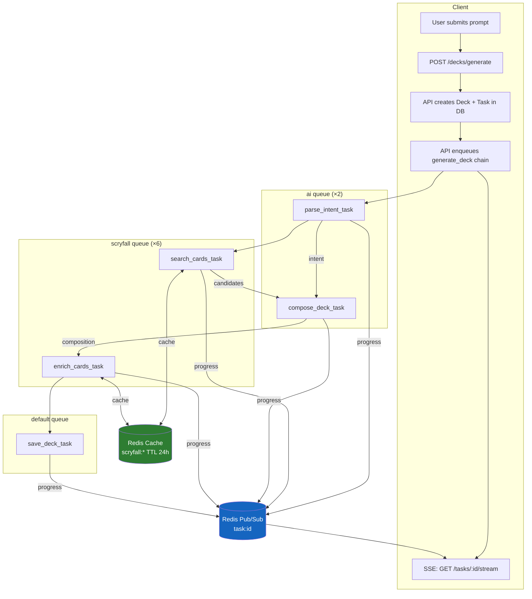
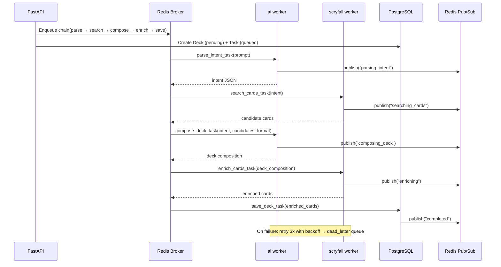

# ADR-0002: Redis & Celery Implementation Strategy

## Status

`Accepted`

## Context

Magic Grimoire's deck generation pipeline is a multi-step process that calls two external APIs (Anthropic Claude and Scryfall), performs database writes, and streams progress to the client via SSE. ADR-0001 selected Redis as the broker/cache/pub-sub layer and Celery as the task queue. This ADR defines **how** these tools are implemented: task decomposition, queue topology, retry and dead-letter strategy, caching patterns, worker configuration, and observability.

## Decision Drivers

- **Granular observability:** Each pipeline step should be independently measurable (duration, failure rate) for debugging and Grafana dashboards.
- **Rate limit isolation:** Claude API and Scryfall have different rate limits and cost profiles — workers for each should scale independently.
- **Resilience:** Transient failures in one external API should not force the entire pipeline to restart from scratch.
- **Learning value:** The implementation should demonstrate industry-standard distributed task orchestration patterns (Celery chains, DLQ, structured logging).
- **Redis consolidation:** Redis serves three roles (Celery broker, Scryfall cache, SSE pub/sub) — the implementation must keep these concerns cleanly separated via key namespacing.
- **Accepted complexity trade-off:** ADR-0001 flagged Celery complexity as a risk with the mitigation "keep worker code simple." This ADR deliberately accepts higher Celery complexity (task chains, DLQ, multi-queue routing) in exchange for granular observability, independent scaling, and learning value.

## Async Pipeline Flowchart



### Task Chain Sequence



## Task Decomposition

The current monolithic `generate_deck_task` is split into **5 chained tasks** using Celery's `chain()` primitive:

| # | Task | Queue | Input | Output |
|---|---|---|---|---|
| 1 | `parse_intent_task` | `ai` | `prompt` | `intent` dict (colors, types, keywords, strategy) |
| 2 | `search_cards_task` | `scryfall` | `intent` | `candidate_cards` list |
| 3 | `compose_deck_task` | `ai` | `intent` + `candidate_cards` + `format` | `deck_composition` dict |
| 4 | `enrich_cards_task` | `scryfall` | `deck_composition.cards` | `enriched_cards` list |
| 5 | `save_deck_task` | `default` | `enriched_cards` + `deck_id` | DB write, publish `completed` |

**Chain invocation:**
```python
from celery import chain

pipeline = chain(
    parse_intent_task.s(prompt),
    search_cards_task.s(),
    compose_deck_task.s(format=format),
    enrich_cards_task.s(),
    save_deck_task.s(deck_id=deck_id),
)
pipeline.apply_async(task_id=task_id)
```

Each task receives the previous task's return value as its first argument (Celery signature chaining).

## Queue Topology & Worker Configuration

| Queue | Tasks | Concurrency | Rationale |
|---|---|---|---|
| `ai` | `parse_intent`, `compose_deck` | 2 | Claude API rate limits + cost control |
| `scryfall` | `search_cards`, `enrich_cards` | 6 | I/O-bound HTTP calls, Scryfall allows ~10 req/s |
| `default` | `save_deck` | 4 | DB writes, lightweight |
| `dead_letter` | Failed tasks (after max retries) | 1 | Inspection only, no auto-reprocessing |

**Worker startup commands:**
```bash
# AI worker — low concurrency for rate-limited Claude API
celery -A app.workers.celery_app worker -Q ai --concurrency=2 -n ai@%h

# Scryfall worker — higher concurrency for I/O-bound calls
celery -A app.workers.celery_app worker -Q scryfall --concurrency=6 -n scryfall@%h

# Default worker — DB writes and general tasks
celery -A app.workers.celery_app worker -Q default --concurrency=4 -n default@%h

# DLQ worker — inspect and log failed tasks
celery -A app.workers.celery_app worker -Q dead_letter --concurrency=1 -n dlq@%h
```

**Docker Compose** will define one service per worker type, all sharing the same backend image.

## Retry & Dead Letter Queue Strategy

### Retry Policy

All pipeline tasks use the same retry configuration:

```python
@celery_app.task(
    bind=True,
    autoretry_for=(Exception,),
    retry_backoff=10,        # 10s → 30s → 90s (exponential)
    retry_backoff_max=90,
    retry_kwargs={"max_retries": 3},
    retry_jitter=True,       # ±random offset to prevent thundering herd
)
def parse_intent_task(self, prompt: str) -> dict:
    ...
```

| Retry | Delay | Cumulative wait |
|---|---|---|
| 1st | ~10s | 10s |
| 2nd | ~30s | 40s |
| 3rd | ~90s | 130s |

### Dead Letter Queue

When a task exhausts all retries, Celery fires the `on_failure` handler:

```python
@celery_app.task(bind=True, ...)
def parse_intent_task(self, prompt: str) -> dict:
    ...

    def on_failure(self, exc, task_id, args, kwargs, einfo):
        dead_letter_task.apply_async(
            args=[task_id, self.name, str(exc), args, kwargs],
            queue="dead_letter",
        )
```

The `dead_letter_task` stores the failure payload for manual inspection:

```python
@celery_app.task(queue="dead_letter")
def dead_letter_task(task_id, task_name, error, args, kwargs):
    logger.error(
        "task_dead_lettered",
        task_id=task_id,
        task_name=task_name,
        error=error,
    )
    # Future: store in a dead_letter DB table for admin UI
```

**Manual replay:** Failed tasks can be re-submitted via Flower or a CLI command after the root cause is fixed.

### Pipeline Failure Behavior

When any step in the chain fails permanently (after 3 retries):

1. The chain stops — downstream tasks are **not executed**
2. The `on_failure` handler routes the failed task to the `dead_letter` queue
3. A `link_error` callback on the chain marks the Deck and Task as `failed` in the DB
4. A `failed` event is published to Redis Pub/Sub so the SSE stream notifies the client

```python
pipeline = chain(
    parse_intent_task.s(prompt),
    search_cards_task.s(),
    compose_deck_task.s(format=format),
    enrich_cards_task.s(),
    save_deck_task.s(deck_id=deck_id),
)
pipeline.apply_async(
    task_id=task_id,
    link_error=on_pipeline_error.s(deck_id=deck_id, task_id=task_id),
)
```

## Redis Caching Strategy

### Key Namespace Convention

| Pattern | Example | TTL | Purpose |
|---|---|---|---|
| `scryfall:search:{query_hash}` | `scryfall:search:a1b2c3d4` | 24h | Scryfall search results (card lists) |
| `scryfall:card:{card_name}` | `scryfall:card:lightning-bolt` | 24h | Individual card data + image URLs |
| `task:{task_id}` | `task:abc-123` | — | Pub/Sub channel (no TTL, ephemeral) |
| `celery` (managed by Celery) | `celery-task-meta-*` | 1h | Task results (Celery result backend) |

### Cache-Aside Pattern

All Scryfall calls use cache-aside (lazy population):

```python
async def search_cards(intent: dict) -> list:
    cache_key = f"scryfall:search:{hash_query(intent)}"
    cached = await redis_cache.get(cache_key)
    if cached:
        return json.loads(cached)

    results = await _call_scryfall_api(intent)
    await redis_cache.set(cache_key, json.dumps(results), ttl=86400)
    return results
```

### Cache Invalidation

- **No active invalidation** — Scryfall data changes infrequently (new sets every ~3 months). The 24h TTL provides natural refresh.
- **Manual flush:** `redis-cli KEYS "scryfall:*" | xargs redis-cli DEL` if a set release requires immediate refresh.

### Redis Memory Management

- **Eviction policy:** `allkeys-lru` — when memory limit is reached, Redis evicts the least recently used keys. This is safe because all cached data can be re-fetched.
- **Max memory:** Set via `redis.conf` or Docker env var (`--maxmemory 256mb` for local dev).

## Celery Configuration

```python
celery_app.conf.update(
    # Serialization
    task_serializer="json",
    result_serializer="json",
    accept_content=["json"],

    # Timezone
    timezone="UTC",
    enable_utc=True,

    # Reliability
    task_acks_late=True,              # ACK after completion, not on receive
    worker_prefetch_multiplier=1,     # Fetch one task at a time (fair scheduling)
    task_reject_on_worker_lost=True,  # Re-queue if worker crashes mid-task
    task_track_started=True,          # Track "started" state in result backend

    # Results
    result_expires=3600,              # Clean up results after 1h

    # Queues
    task_default_queue="default",
    task_routes={
        "app.tasks.parse_intent_task": {"queue": "ai"},
        "app.tasks.compose_deck_task": {"queue": "ai"},
        "app.tasks.search_cards_task": {"queue": "scryfall"},
        "app.tasks.enrich_cards_task": {"queue": "scryfall"},
        "app.tasks.save_deck_task": {"queue": "default"},
        "app.tasks.dead_letter_task": {"queue": "dead_letter"},
    },
)
```

Key setting: **`task_acks_late=True`** + **`task_reject_on_worker_lost=True`** ensures that if a worker crashes mid-task, the message returns to the queue and is picked up by another worker. This is the closest Redis gets to message durability without RabbitMQ.

## Observability

| Layer | Tool | What it provides |
|---|---|---|
| **Task monitoring** | Flower | Real-time task state, worker status, queue depths, task detail inspection |
| **Structured logging** | `structlog` (JSON) | Every log line includes `task_id`, `step`, `duration_ms`, `queue` |
| **Log aggregation** | Loki (future) | Centralized search across all workers — query by `task_id` to trace a full pipeline |
| **Dashboards** | Grafana (future) | Redis memory usage, queue depth over time, task latency p50/p95/p99, failure rate by step |

### Structured Log Format

```python
import structlog

logger = structlog.get_logger()

# Inside each task:
logger.info(
    "task_started",
    task_id=self.request.id,
    task_name=self.name,
    queue=self.request.delivery_info.get("routing_key"),
)
```

Example log output:
```json
{
  "event": "task_started",
  "task_id": "abc-123",
  "task_name": "parse_intent_task",
  "queue": "ai",
  "timestamp": "2026-03-28T14:30:00Z",
  "level": "info"
}
```

## Considered Options

### Queue Topology

| Option | Pros | Cons |
|---|---|---|
| **A. Priority-based queues** (monolithic task, `default` + `fast` queues) | Simple, no refactor needed | No per-step observability, all-or-nothing retries |
| **B. Task-per-step chain** (separate tasks + dedicated queues) ✅ | Granular retry, independent scaling, per-step metrics, industry-standard | More complex debugging, chain orchestration overhead |
| **C. Hybrid** (monolithic now, split later) | Ships fast, future-proof | Can't scale AI vs Scryfall independently, deferred complexity |

### Retry Strategy

| Option | Pros | Cons |
|---|---|---|
| **A. Task-level retry + DLQ** ✅ | Covers all failure modes, failed tasks inspectable | Whole chain fails if one step is permanently broken |
| **B. Step-level retry only** (no DLQ) | Simpler | Lost visibility into permanently failed tasks |
| **C. No retry** | Simplest | Bad UX on transient API failures |

## Decision

**Chosen: Task-per-step chain (Option B) with task-level auto-retry and dead letter queue.**

The pipeline is decomposed into 5 chained Celery tasks routed to 3 specialized queues (`ai`, `scryfall`, `default`) plus a `dead_letter` queue. Each task retries 3 times with exponential backoff before being parked in the DLQ. Redis serves as broker, cache (with `scryfall:` key namespace, 24h TTL, `allkeys-lru` eviction), and SSE pub/sub (`task:{id}` channels). This approach was chosen because it demonstrates industry-standard distributed task orchestration, enables per-step observability for future Grafana dashboards, and allows independent scaling of AI and Scryfall workers under different rate limit constraints.

## Consequences

### Positive

- Each pipeline step is independently observable, retryable, and scalable
- Dead letter queue prevents silent task loss — failed tasks are always inspectable
- Redis key namespacing cleanly separates broker, cache, and pub/sub concerns
- Structured logging with `task_id` enables full pipeline tracing across workers
- Clear migration path to Loki + Grafana for production-grade observability

### Negative

- Chain debugging is harder than a single monolithic task — errors propagate through `link_error` callbacks
- More Docker Compose services (one per worker type) increases local dev resource usage
- Celery chain intermediate results are stored in Redis, adding memory pressure

### Risks

- **Chain state loss on Redis crash:** If Redis restarts, in-flight chain state is lost. Mitigation: `task_acks_late` + `task_reject_on_worker_lost` re-queues unacknowledged tasks, but partially completed chains may need manual cleanup.
- **Celery chain complexity:** Debugging chained task failures requires understanding Celery's callback model. Mitigation: structured logging with `task_id` and Flower for visual inspection.
- **Claude API cost on retries:** Each retry of `parse_intent` or `compose_deck` incurs API costs. Mitigation: 3-retry cap with exponential backoff limits worst-case spend.

## Related

- [[adr/ADR-0001-tech-stack-selection|ADR-0001: Tech Stack Selection]]
- [[adr/index]]
- [[Home]]
